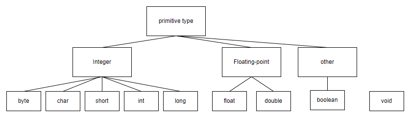
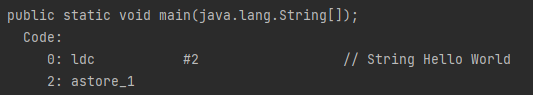
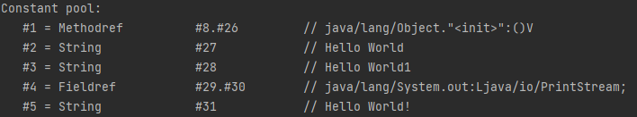

https://github.com/whiteship/live-study/issues/2#issue-739427716

# 목표

자바의 프리미티브 타입, 변수 그리고 배열을 사용하는 방법을 익힙니다.

# 학습할 것

1. 프리미티브 타입 종류와 값의 범위 그리고 기본 값
2. 프리미티브 타입과 레퍼런스 타입
3. 리터럴
4. 변수 선언 및 초기화하는 방법
5. 변수의 스코프와 라이프타임
6. 타입 변환, 캐스팅 그리고 타입 프로모션
7. 1차 및 2차 배열 선언하기
8. 타입 추론, var

## 프리미티브 타입 종류와 값의 범위 그리고 기본 값

총 8가지 타입이 있음



크게 3가지 종류로 나눌 수 있습니다

1. 정수형
2. 부동 소수점
3. 그 외

### 정수형

1. byte : 기본값 0<br/>
   범위 : -128 이상 127 이하까지 가능
2. char : 기본값 '\u0000'<br/>
   모든 유니코드 문자가 가능<br/>
   범위 : 0부터 2^16-1 이하까지 가능
3. short : 기본값 0<br/>
   범위 : -2^15 부터 2^15-1 까지 가능
4. int : 기본값 0<br/>
   범위 : -2^31부터 2^31-1 까지 가능
5. long : 기본값 0L<br/>
   범위 : -2^63부터 2^63-1 까지 가능

### 부동 소수점

1. float : 0.0f<br/>
   범위 : -3.4*10^38부터 3.4*10^38까지 가능
2. double : 0.0d<br/>
   범위 : -1.7*10^308부터 1.7*10^308까지 가능

### 그 외

1. boolean : 기본값 false<br/>
   true, false 두가지 값만 가질 수 있음
2. void<br/> : 프리미티브 타입은 아님
   리턴값이 없을 때 사용

### 정수형 표현 방식

비트 단위로 봤을 때 제일 앞 부분은 부호를 나타내는 비트입니다. 0이면 양수, 1이면 음수입니다. 그리고 나머지 비트는 값의 크기를 나타냅니다.

음수의 표현 방식은 2의 보수를 사용합니다. 2의 보수는 1의 보수를 구하고 1을 더하는 방식입니다. 1의 보수는 비트를 반전시키는 방식입니다. 예를 들어 5를 2진수로 표현하면
101이고 1의 보수는 010이 됩니다. 2의 보수는 011이 됩니다.

### 부동 소수점 표현 방식

부동 소수점은 실수를 표현하는 방식입니다. 부동 소수점은 2진수로 표현할 수 없는 실수를 표현하기 위해 사용됩니다. 예를 들어 0.1을 2진수로 표현하면 무한 소수가 됩니다.
그래서 0.1을 2진수로 표현하면 0.0001100110011001100110011001100110011001100110011001101... 이 됩니다.
이렇게 표현하면 2진수로 표현할 수 없는 실수가 됩니다. 그래서 부동 소수점을 사용합니다.

https://ko.wikipedia.org/wiki/%EB%B6%80%EB%8F%99%EC%86%8C%EC%88%98%EC%A0%90
이 방식을 통해서 계산할 수 있다
1비트는 부호 비트
e비트는 지수
f비트는 가수

## 프리미티브 타입과 레퍼런스 타입

### 프리미티브 타입

프리미티브 타입은 변수에 실제 값을 저장합니다. 프리미티브 타입은 크기가 정해져 있습니다. 프리미티브 타입은 스택에 저장됩니다.
모든 값은 유요한 타입이기에, 쓸 수 없는 타입은 없습니다

### 레퍼런스 타입

레퍼런스 타입은 변수에 값이 아닌 주소를 저장합니다. 레퍼런스 타입은 크기가 정해져 있지 않습니다. 레퍼런스 타입은 힙에 저장됩니다.
null이 할당될 수 있습니다
참조 변수는 4바이트 혹은 운영체제에 따라서 8바이트도 가능합니다

## 리터럴



```java
class Main {

    public static void main(String[] args) {
        String s = "Hello World";
        String s2 = "Hello World";
        String s3 = "Hello World1";
        System.out.println("Hello World!");
    }
}
```

를 바이트코드로 만들고 해석한 결과이다
ldc라는 명령은 상수 풀에 있는 값을 가져오는 명령이다

위에 나온 것처럼 같은 스트링이 정의되면, 이는 하나의 상수 풀에서 관리된다

## 변수 선언 및 초기화하는 방법

선언 후에 무조건 초기화가 이루어져야 사용할 수 있다.
지역변수같은 경우에는 선언 후 초기화가 이루어지지 않은 상태로 접근할 경우 컴파일 에러가 발생한다
멤버 변수의 초기화 방식은 여러가지가 있다

1. 명시적 초기화
2. 생성자
3. 초기화 블럭
4. 기본값

### 명시적 초기화

```java
class Main {

    public static void main(String[] args) {
        int a = 10;
        int b = 20;
        int c = 30;
        System.out.println("Hello World!");
    }
}
```

### 생성자

```java
class Construct {

    private int a;
    private int b;
    private int c;

    Construct() {
        a = 10;
        b = 20;
        c = 30;
    }
}
```

### 초기화 블럭

```java
class InitBlock {

    private int a;
    private int b;
    private int c;

    {
        a = 10;
        b = 20;
        c = 30;
    }
}
```

### 기본값

```java
class DefaultValue {

    private int a;
    private int b;
    private int c;
}
```

순서는 기본값->명시적초기화->초기화블럭->생성자 순으로 초기화가 이루어진다

## 변수의 스코프와 라이프타임

지역변수 : 선언된 블럭 내에서 사용 가능
인스턴스 변수 : 클래스의 인스턴스가 생성될 때 생성되고, 인스턴스가 소멸될 때 소멸
클래스 변수 : 클래스가 메모리에 로딩될 때 생성되고, 프로그램이 종료될 때 소멸
매개 변수 : 메서드가 호출될 때 생성되고, 메서드가 종료될 때 소멸

## 타입 변환, 캐스팅 그리고 타입 프로모션

### 타입 변환 = 형변환 타입을 다른 타입으로 변환하는 것

타입 변환이란 하나의 타입을 다른 타입으로 변환하는 것을 말한다
자바에서는 묵시적 타입 변환과 명시적 타입 변환으로 나뉜다

### 묵시적 타입 변환

묵시적 타입 변환은 자동으로 타입 변환이 이루어지는 것을 말한다
예를 들어, int 타입의 변수에 long 타입의 값을 대입하면 자동으로 long 타입이 int 타입으로 변환된다
더 큰 타입으로 할당하는 것인데, 구체 클래스를 interface 에 대입하는 것도 포함한다

### 명시적 타입 변환

명시적 타입 변환은 개발자가 직접 타입을 변환해야 하는 것을 말한다
예를 들어, int 타입의 변수에 long 타입의 값을 대입하려면 int 타입으로 변환해야 한다
예외적으로 char은 음수가 될 수 있는 타입이 들어오면 예외를 만들어낸다

### 캐스팅 : 상속 구조에서 상위 타입을 하위 타입으로 변환하는 것

```java
class CastingTest {

    public static void main(String[] args) {
        Car car = null;
        FireEngine fe = new FireEngine();

        fe.water();
        car = fe; // car = (Car)fe; 로 캐스팅을 해줘야 한다
        car.drive();
        // car.water(); // 컴파일 에러
    }
}
```

### 타입 프로모션

상위 타입에 하위 타입을 대입하는 것
캐스팅과 반대

## 1차 및 2차 배열 선언하기

```java
public class Main {

    public static void main(String[] args) {
        int[] temp = {1, 2, 3, 4};
        int[][] temp1 = {{1}, {2}, {3}, {4}};
        int[][] temp2 = {{1, 2}, {2}, {3}, {4}};
    }
}
```

이것도 가능하다는 게 신기했다
배열은 포인터로 접근만 하는 느낌이기에, 2차원 배열은 1차원 배열의 배열이라고 생각하면 된다
당연하지만 그렇기에 2차원 배열은 꼭 열의 수가 같은 필요가 없다

## 타입 추론, var

var는 로컬 variable, for-each loop, catch 블록에서만 사용할 수 있다

```java
public class Main {

    public static void main(String[] args) {
        var temp = 1;
        var temp1 = new int[]{1, 2, 3, 4};
        var temp2 = new int[][]{{1, 2}, {2}, {3}, {4}};
    }
}
```

var 은 키워드가 아니다
컴파일러가 타입을 추론해서 대입해준다
런타임 오버헤드도 없다
var 를 사용했을 경우에 이제 타입에 어노테이션 붙히는 과정을 조금 편하게 쓸 수도 있다는 장점이 있다고 한다

# 추가 피드백

* 자바에서는 unsigned 가 가능하다

```java
class Unsigned {

    public static void main(String[] args) {
        int unsigned = Integer.parseUnsignedInt("2222222222");
        System.out.println(unsigned);//음수
        System.out.println(Integer.toUnsignedString(unsigned));//양수
    }
}
```

* 0x 를 붙이면 16진수로 인식한다